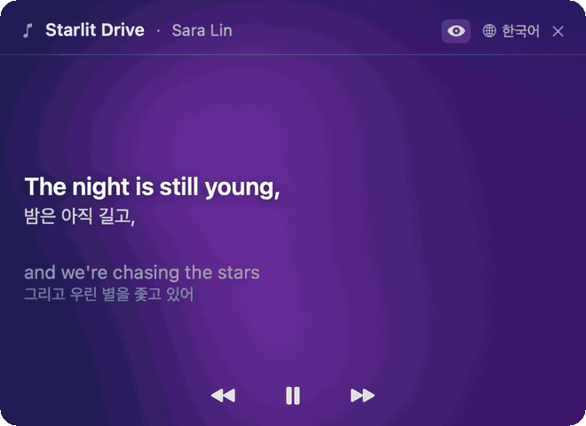

# Versa

> Live lyrics and translation, right in your menu bar.

A Mac menu bar app that shows synced lyrics for whatever's playing on Spotify or Apple Music — and pre-translates every line in 9 languages before the song even starts.

**[Get Versa →](https://currenjin.github.io/versa/)** &nbsp;·&nbsp; **[Latest Release](https://github.com/currenjin/versa/releases/latest)** &nbsp;·&nbsp; **[Issues](https://github.com/currenjin/versa/issues)**

## What is this repo?

This is the **public-facing repo** for Versa — it hosts:

- The landing page at [currenjin.github.io/versa](https://currenjin.github.io/versa/)
- Release artifacts (`.dmg`, screenshots, demo videos)
- The issue tracker

The application source lives in a separate private repository.

## Download

Latest stable build: [`Versa.dmg`](https://github.com/currenjin/versa/releases/latest/download/Versa.dmg)

**Requirements**: macOS 13+ · Apple Silicon (M1 or later)

> Versa isn't Apple-notarized yet, so the first launch needs a one-time **right-click → Open**. After approval, it opens like any other app from Launchpad or Spotlight.

See the [install guide](https://currenjin.github.io/versa/#install) for details.

## Features

- **3-line focus** — previous, current, and next lyric, with the surrounding lines fading naturally
- **Pre-translation** — every line in the song is translated in parallel the moment a track loads
- **9 languages** — Korean · English · Japanese · Simplified Chinese · Traditional Chinese · Spanish · French · German · Vietnamese
- **Ambient backdrop** — six gradient palettes glide between each other as the lines pass
- **Instant toggle** — eye icon to flip between original and translated, persists across launches
- **Playback controls** — play, pause, previous, next — all from the menu bar window

## License

Copyright © 2026 currenjin. All rights reserved.
